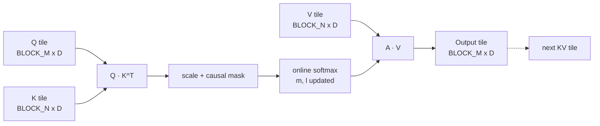

<div align="center">


<a href="https://github.com/Umarfarook1/Triton-attention-kernels">
  
</a>

<br/>

<p>
  
  
  
  
  
  
</p>

<sub><i>If you can't beat <code>F.scaled_dot_product_attention</code>, you don't really understand attention. This repo is the receipts.</i></sub>

</div>

---

## Why this repo exists

PyTorch's fused-attention kernel is fast · but it's a black box. The point of this repo is to rebuild the transformer hot path from first principles in Triton: attention, RMSNorm, SwiGLU, RoPE · each as an independently benchmarked kernel with ablations on tile size, num_warps, and pipeline depth, plus a writeup of *why* each choice matters.

> **Status:** kernel scaffolding + benchmark harness. First milestone: forward attention within 5% of `F.scaled_dot_product_attention` on H100.

## Kernel zoo

| Kernel | Forward | Backward | Status | Notes |
|---|:-:|:-:|---|---|
| Fused causal attention | ✅ planned | ⏳ | scaffolding | online softmax + KV tiling |
| Paged-KV decode attention | ⏳ | n/a | planned | for serving |
| RMSNorm | ✅ planned | ⏳ | scaffolding | fused gain |
| SwiGLU | ✅ planned | ⏳ | scaffolding | fused with linear projection |
| RoPE (apply + cache) | ✅ planned | n/a | scaffolding | dim-split layout |
| Cross-entropy + chunked logits | ⏳ | ⏳ | planned | memory-saver à la Liger |

## Tiling intuition



Each Q tile scans all KV tiles, accumulating the softmax statistics `(m, l)` and the partial output online · i.e., never materializing the full `BLOCK_M × N` attention matrix. This is the FlashAttention insight, restated in Triton.

## Benchmark methodology

- **Hardware:** H100 80GB SXM, A100 40GB PCIe (separate tables per device)
- **Baseline:** `torch.nn.functional.scaled_dot_product_attention` (Flash backend), `torch.nn.RMSNorm`, `torch.nn.SiLU + linear` for SwiGLU
- **Workloads:** sweep over `(B, H, S, D)` covering common transformer shapes (S ∈ {512, 2k, 8k, 32k}, D ∈ {64, 128})
- **Metric:** TFLOPS (compute-bound) and ms/iter (memory-bound), median of 100 runs after warmup
- **Numerical check:** max-abs and mean-abs vs reference, must be within fp16 noise

## Quickstart <sub><i>(coming soon)</i></sub>

```bash
# install
uv pip install -e .

# run a benchmark sweep
uv run bench/attention.py --device cuda --shapes configs/h100.yaml --out reports/h100.md

# correctness suite
uv run pytest tests/

# ablation: tile size for attention forward
uv run bench/attention.py --ablate BLOCK_M:64,128,256 --ablate BLOCK_N:64,128
```

## Headline numbers <sub><i>(populated as kernels land)</i></sub>

| Kernel | Shape | torch SDPA (ms) | this repo (ms) | speedup |
|---|---|---|---|---|
| Causal attn fwd | (4, 16, 4096, 128) | TBD | TBD | TBD |
| Causal attn bwd | (4, 16, 4096, 128) | TBD | TBD | TBD |
| RMSNorm fwd | (B=4, S=4096, D=4096) | TBD | TBD | TBD |
| SwiGLU fwd | (B=4, S=4096, D=11008) | TBD | TBD | TBD |

## Roadmap

- [ ] Triton scaffolding + autotune + correctness harness
- [ ] Fused causal attention forward (online softmax)
- [ ] Fused causal attention backward
- [ ] RMSNorm forward + backward
- [ ] SwiGLU fused projection
- [ ] RoPE apply + cache write
- [ ] Cross-entropy with chunked logits (memory saver)
- [ ] H100 + A100 benchmark report (Markdown + plots)
- [ ] Companion blog post on tile-size selection
- [ ] Optional: integrate into a fork of `nanoGPT` for end-to-end speedup numbers

## Inspiration & required reading

- [GPU MODE · lectures & community](https://github.com/gpu-mode/lectures)
- [ScalingIntelligence/KernelBench](https://github.com/ScalingIntelligence/KernelBench) · kernel benchmarking methodology
- [linkedin/Liger-Kernel](https://github.com/linkedin/Liger-Kernel) · production-quality fused training kernels
- [Triton tutorials](https://triton-lang.org/main/getting-started/tutorials/index.html)
- [Dao-AILab/flash-attention](https://github.com/Dao-AILab/flash-attention) · the paper that started it
- [pytorch/ao](https://github.com/pytorch/ao) · quantization + fused-op patterns

---

<div align="center">

</div>
